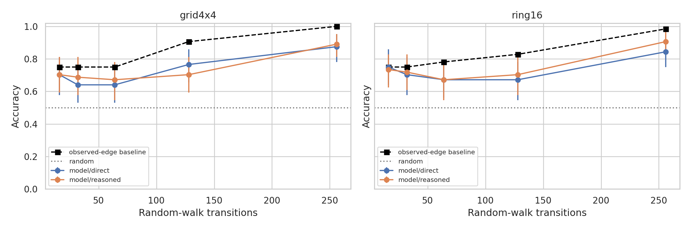
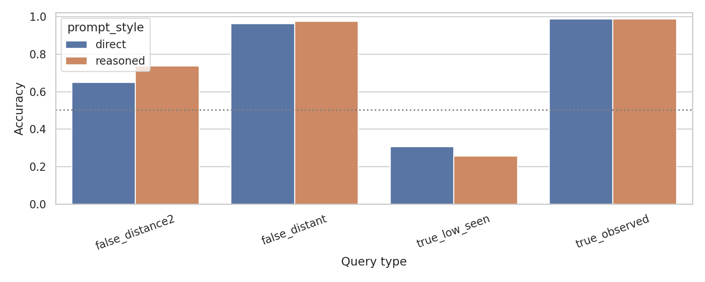
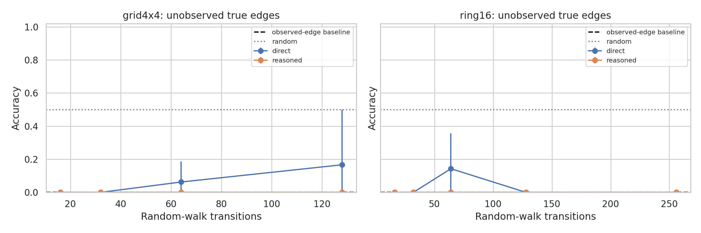

# Are Repeated Novel Geometries Addressable Without Reasoning?

## 1. Executive Summary

This study tested whether the in-context graph geometries studied by Park et al. in "ICLR: In-Context Learning of Representations" ([arXiv:2501.00070](https://arxiv.org/abs/2501.00070)) are verbally addressable through prompting. I generated hidden 4x4 grid and 16-node ring tasks where ordinary words were randomly assigned to graph nodes, supplied random-walk traces as context, and asked `gpt-4.1` to answer adjacency questions either directly with JSON only or with an explicit-reasoning prompt.

The main finding is negative for sparse and non-repeated relations: `gpt-4.1` reliably addressed edges that were directly repeated in the prompt, but almost never recovered true graph adjacencies that were not observed in the trace. Direct no-reasoning accuracy was 72.7% overall, above random, but below the observed-edge memorization baseline of 82.5%. On truly unobserved positive edges, direct prompting scored 4/112 = 3.6%, and explicit reasoning scored 0/112.

Practical implication: these in-context geometries are verbally addressable mainly as repeated transition memories. This experiment does not support the stronger claim that a model can expose a newly learned 2D topology through ordinary prompting when there is little repetition.

## 2. Research Question & Motivation

The user-provided motivation was: models appear to learn 2D geometries in context; can those geometries be addressed verbally through prompting, and what happens with limited repetition?

The ICLR paper reports that, as context length increases, internal representations can reorganize around context-specified square-grid, ring, and hex-grid structures. That leaves a behavioral gap: internal geometric structure might exist without being accessible through a natural-language query. The pre-gathered visual-geometry review also emphasized that direct prompting often underperforms symbolic or repeated-example conditions, motivating a no-CoT repetition-curve test.

## 3. Experimental Setup

**Model tested:** `gpt-4.1` through the OpenAI Chat Completions API, temperature 0, API seed 42, JSON response format. Model availability was checked via the live OpenAI model list on 2026-06-01.

**Task:** hidden graph tracing. Sixteen ordinary words were randomly assigned to nodes of either a 4x4 square grid or a 16-node ring. A random-walk trace exposed adjacent word transitions. The model then answered eight bundled adjacency questions: `current=<word>, candidate=<word>`, with YES/NO labels.

**Design:** 2 graph types x 5 context lengths x 8 random seeds x 2 prompt styles x 8 queries = 1,280 scored query-level examples from 160 real API calls.

**Context lengths:** 16, 32, 64, 128, and 256 transitions, corresponding roughly to 1, 2, 4, 8, and 16 visits per node on average.

**Prompt styles:** direct no-reasoning JSON-only output, and an explicit-reasoning ablation that asked the model to reconstruct likely adjacencies before returning JSON.

**Query types:** observed true edge, low-seen/unobserved true edge, false distance-2 pair, and distant false pair.

**Baselines:** random choice at 50%; always-no; observed-edge memorization, which predicts YES only when the candidate edge appeared in the trace.

**Compute and environment:** Python 3.12.8 in the project `.venv`; main libraries were `openai 2.38.0`, `pandas 3.0.3`, `matplotlib 3.10.9`, `scipy 1.17.1`, and `seaborn 0.13.2`. Four NVIDIA RTX A6000 GPUs were available, each with 49,140 MiB memory, but the experiment was API-bound and did not use GPU acceleration.

**Token/cost tracking:** 77,510 prompt tokens and 28,599 completion tokens were used, for 106,109 total tokens. Using the official OpenAI pricing page as the cost reference ([OpenAI API pricing](https://platform.openai.com/docs/pricing)), the run was well under one dollar at current `gpt-4.1` rates.

## 4. Results

| Prompt | Graph | L=16 | L=32 | L=64 | L=128 | L=256 |
|---|---|---:|---:|---:|---:|---:|
| Direct | grid4x4 | 0.703 | 0.641 | 0.641 | 0.766 | 0.875 |
| Direct | ring16 | 0.750 | 0.703 | 0.672 | 0.672 | 0.844 |
| Reasoned | grid4x4 | 0.703 | 0.688 | 0.672 | 0.703 | 0.891 |
| Reasoned | ring16 | 0.734 | 0.719 | 0.672 | 0.703 | 0.906 |
| Observed-edge baseline | grid4x4 | 0.750 | 0.750 | 0.750 | 0.906 | 1.000 |
| Observed-edge baseline | ring16 | 0.750 | 0.750 | 0.781 | 0.828 | 0.984 |

All graph/context cells were above the 50% random baseline after Holm correction, but the model never exceeded the observed-edge baseline. Paired McNemar tests showed the memorization baseline was significantly better in most medium/high repetition cells; no cell showed a significant model advantage over memorization.

| Prompt | Observed true | Low-seen true | False distance-2 | False distant |
|---|---:|---:|---:|---:|
| Direct | 0.988 | 0.306 | 0.650 | 0.963 |
| Reasoned | 0.988 | 0.256 | 0.738 | 0.975 |
| Observed-edge baseline | 1.000 | 0.300 | 1.000 | 1.000 |

The critical slice is low-seen true edges. When those edges had never appeared in the prompt, direct prompting got only 4/112 correct, and explicit reasoning got 0/112 correct.

Raw outputs are in `results/model_outputs/`. Scored query-level data and statistics are in `results/evaluations/`.

## 5. Analysis & Discussion

The model is clearly using repeated local evidence. Observed true edges were almost perfectly addressable: 98.8% accuracy under both prompt styles. Edges seen at least twice were also nearly always answered YES in the low-seen category.

The model did not infer hidden topology well from sparse traces. For unobserved true edges, the direct condition found only four positives across 112 cases, and the reasoned condition found none. This is the key result for the user's "what if there isn't that much repetition?" question: without repeated transition evidence, the prompt-accessible geometry largely disappears.

Explicit reasoning did not rescue addressability. Overall accuracy rose only from 72.7% to 73.9%, and a paired direct-vs-reasoned comparison was not significant (McNemar p = 0.256). Reasoning improved some false distance-2 rejection but made unobserved positives worse.

A notable failure mode was near-neighbor false positives. False distance-2 pairs were much harder than distant false pairs, especially at longer traces where the model sometimes treated graph-proximal words as adjacent. This suggests it may form a vague locality notion without reliably resolving exact edges.

## 6. Limitations

This was a behavioral API study, not an internal representation analysis. It cannot tell whether `gpt-4.1` internally formed a geometric representation that was inaccessible through the prompts, or whether no such representation formed.

Only one frontier model was tested. The ICLR paper focused on Llama-family internal activations, so model-family differences remain open.

The task evaluated adjacency because unlabeled random walks do not identify absolute north/south/east/west directions. Directional verbal addressability would require adding directed move labels or coordinate probes.

Queries were bundled within traces, so query-level examples are not fully independent. The analysis reports bootstrap intervals and paired tests, but the effective sample size is closer to the 80 graph/context bundles per prompt style than to 640 independent queries.

## 7. Conclusions & Next Steps

Answer: repeated in-context geometries are verbally addressable when the relevant edge has appeared in the prompt, but this run found little evidence that `gpt-4.1` can verbally address unobserved parts of the induced 2D geometry without explicit or repeated support. Limited repetition produced above-random performance, but the gains were explained better by observed-edge memorization than by topology inference.

Useful follow-up experiments would test GPT-5-class and open-weight models, add directed random-walk labels to probe coordinate addressability, compare against a graph-reconstruction algorithm, and reproduce the behavioral probes on the exact models from the ICLR representation study.

## References

- Park, C. F., Lee, A., Lubana, E. S., Yang, Y., Okawa, M., Nishi, K., Wattenberg, M., & Tanaka, H. (2025). ICLR: In-Context Learning of Representations. arXiv:2501.00070. https://arxiv.org/abs/2501.00070
- Local gathered review: `literature_review.md`
- Local resource catalog: `resources.md`
- OpenAI API pricing reference: https://platform.openai.com/docs/pricing
